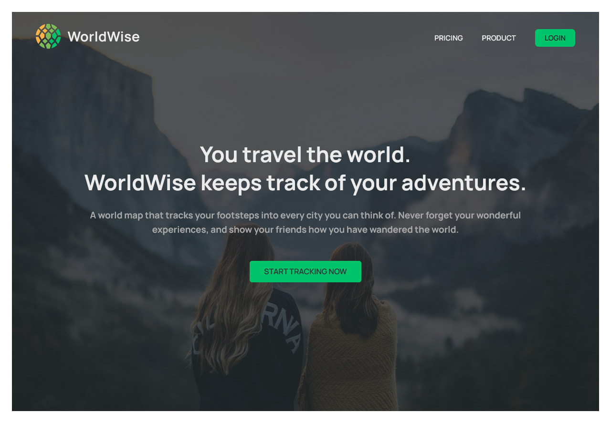
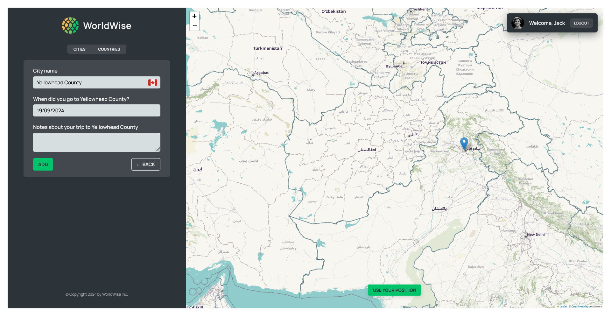

# WorldWise

WorldWise app, developed with guidance from Jonas Schmedtmann's ReactJS + NextJS course.

## Screenshots

#### Desktop




## Run Locally

Clone the project

```bash
  git clone https://github.com/ei-abdullah/WorldWise.git
```

Go to the far-away directory

```bash
  cd WorldWise
```

Install dependencies

```bash
  npm install
```

Start the development and json server

```bash
  npm run server
```

```bash
  npm run dev
```

## Tech Stack

**Client:** React, React-Router, TailwindCSS, Javascript, CSS, HMTL
**Map:** React-Leaflet

## 🔗 Links

[](https://www.linkedin.com/in/eiabdullah/)
[](https://x.com/blocAbdullah)

## License

[MIT](https://choosealicense.com/licenses/mit/)
